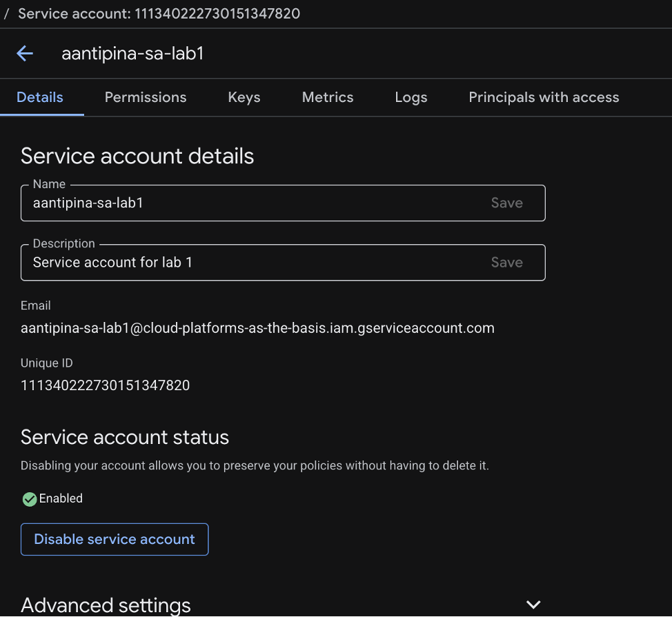
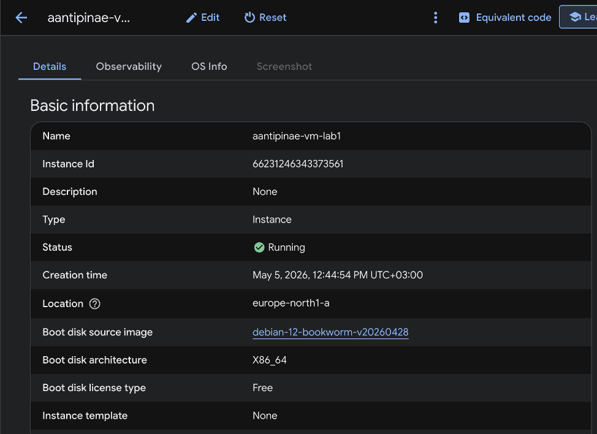
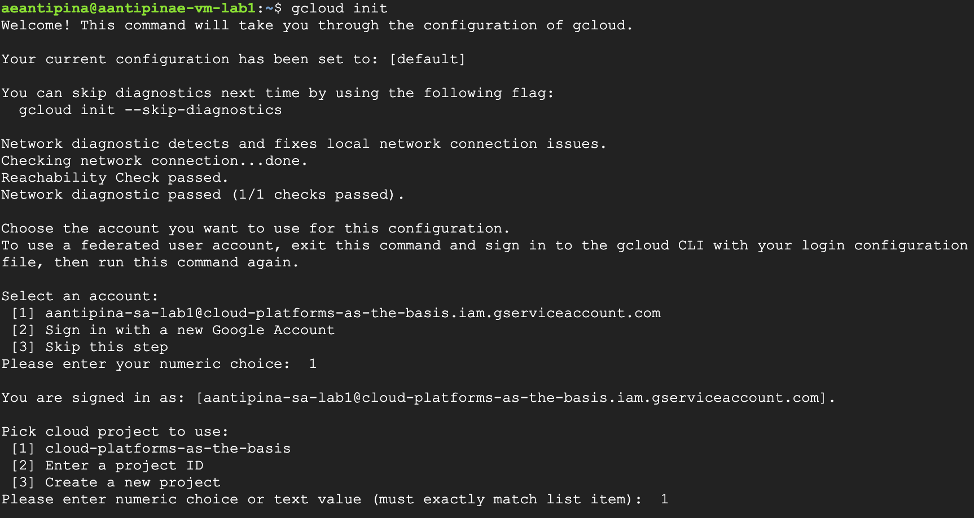
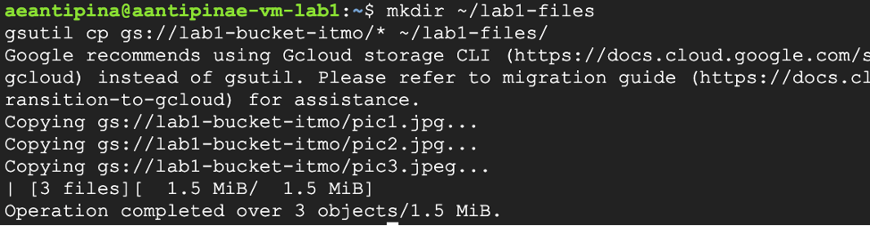
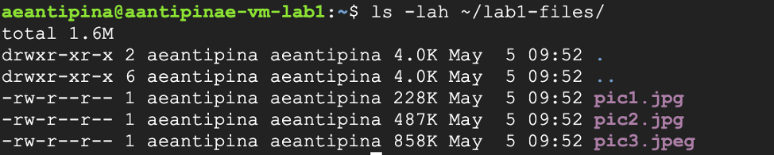
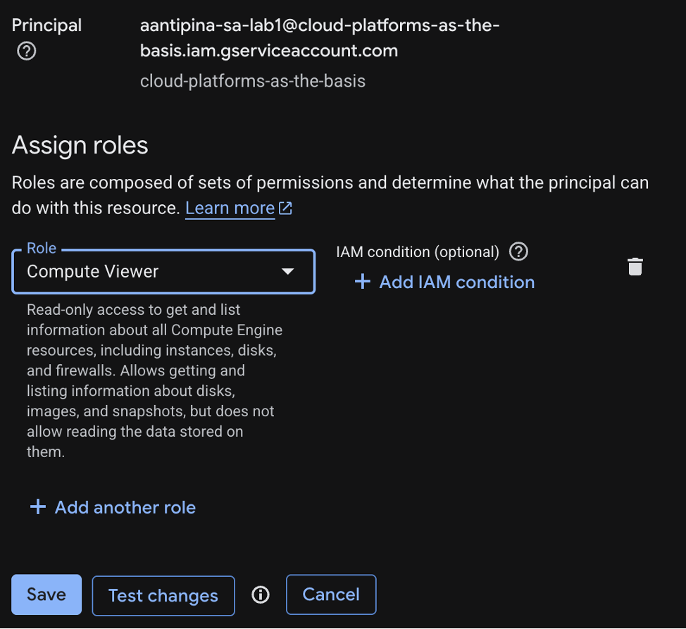
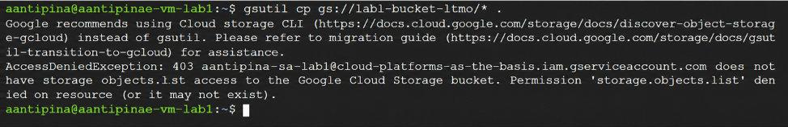

University: [ITMO University](https://itmo.ru/ru/)  
Faculty: [FICT](https://fict.itmo.ru)  
Course: [Cloud platforms as the basis of technology entrepreneurship](https://itmo-ict-faculty.github.io/cloud-platforms-as-the-basis-of-technology-entrepreneurship)  
Year: 2025/2026  
Group: U4125  
Author: Antipina Anastasia Evgenievna  
Lab: Lab1  
Date of create: 04.05.2026  
Date of finished: 

# Отчёт по лабораторной работе №1 **«Обзор Google Cloud и исследование основных сервисов.»**

### Шаг 1. Получение доступов к GCP  

* Заполнила гугл-форму, указав свою Gmail-почту;  
* Вошла в Google cloud под выданными учётными данными.  

### Шаг 2. Создание service account  

* Перешла в раздел IAM и нажала Create service account;  
* Указала имя: ```text aantipina-sa-lab1```;  
* Выбрала роль: Storage Admin.  

<a>
  
</a>


### Шаг 3. Развёртывание Compute Engine (VM)  

* Перешла в раздел Compute Engine → Create instance;  
* Указала параметры:  
```text 
Name: aantipina-vm-lab1
Machine type: e2-micro
Networking: default
Spot instance: включён
```
* Нажала Create → дождалась развёртывания VM.  
<a>
  
</a>

### Шаг 4. Копирование файлов из бакета на VM  

* Подключилась к VM по SSH;  
* Установила утилиту gcloud `sudo apt-get update && sudo apt-get install google-cloud-sdk`;  
* Инициализировала gcloud: `gcloud init`;  

<a>
  
</a>

* Из бакета lab1-bucket-itmo скопировала 3 файла в локальную папку:

<a>
  
</a>

* Проверила содержимое папки: `ls -lah ~/lab1-files/` в результате на экране отобразился вывод трех файлов:

<a>
  
</a>

* Ради интереса сохранила данные файлы на локальном диске:  

<a>
  
</a>

### Шаг 5. Изменение прав доступа и повторная попытка копирования  

* Вернулась в Google Cloud Console → IAM & Admin → Service Accounts;  
* Нашла свой service account и во вкладке Permissions заменила роль Storage Admin на Compute Viewer:  

<a>
  
</a>

* Вернулась к SSH‑сессии на VM и повторила команду копирования `gsutil cp gs://lab1-bucket-itmo/* ~/lab1-files/`;
* В результате получила ошибку доступа, что подтверждает, что роль Compute Viewer не позволяет работать с бакетами.  

<a>
  
</a>

* Далее все ресурсы были удалены.

# Выводы:

* Роль Storage Admin предоставляет полный доступ к Cloud Storage, что позволяет копировать файлы между бакетами и VM;
* Роль Compute Viewer даёт только права на просмотр информации о Compute Engine и не позволяет работать с Cloud Storage, сервисные аккаунты должны иметь только необходимые права;
* Spot — экономичный вариант для некритичных задач, но с риском прерывания работы.
