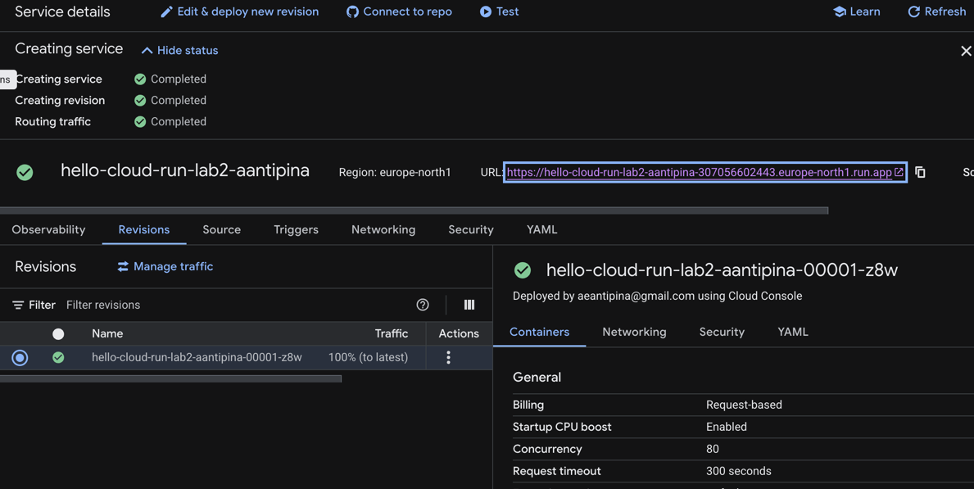
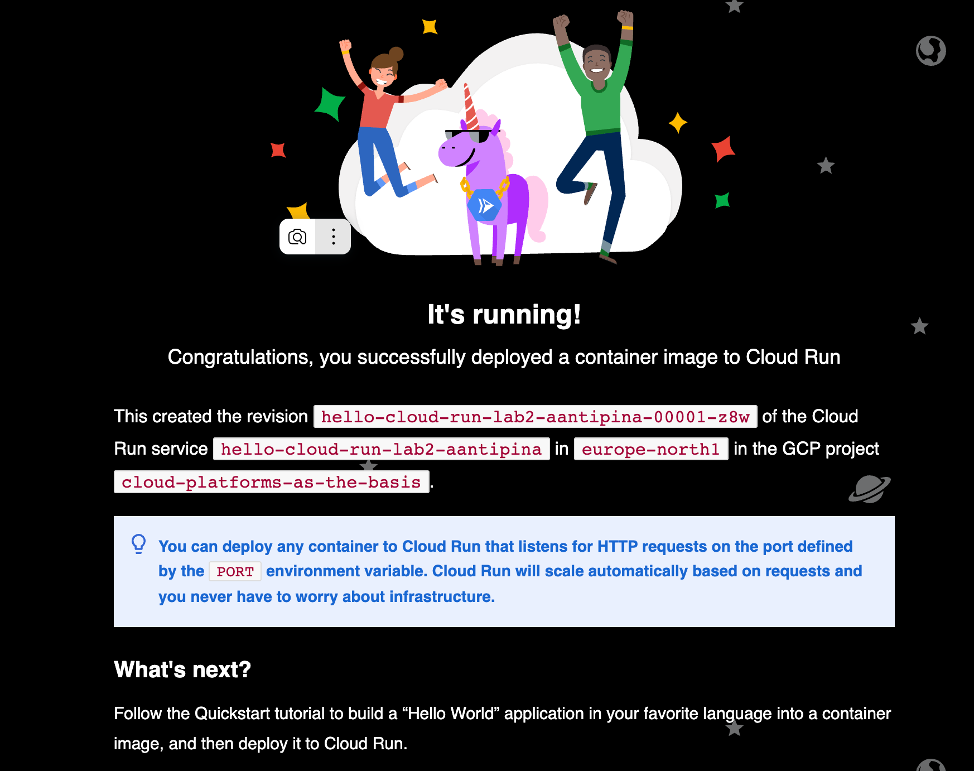
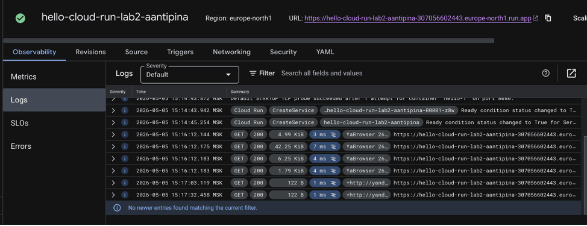
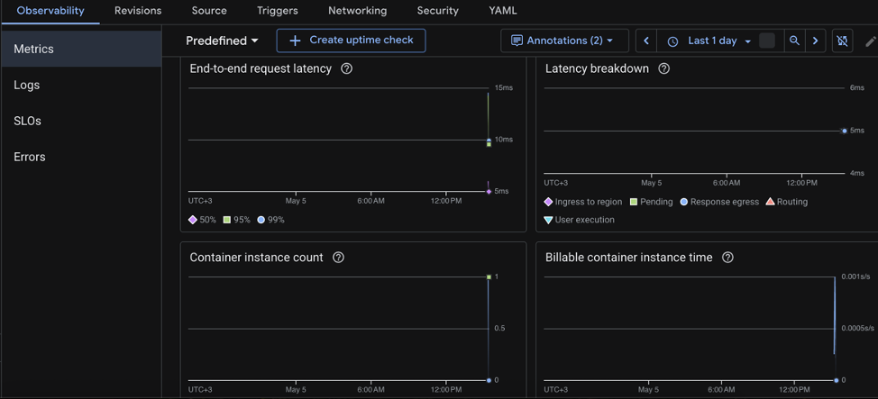
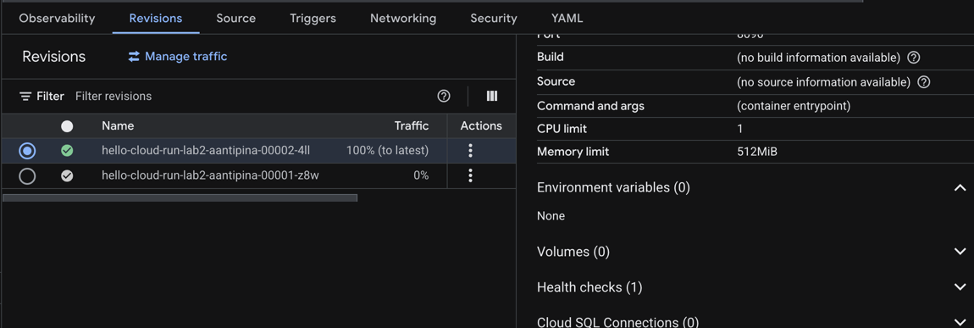
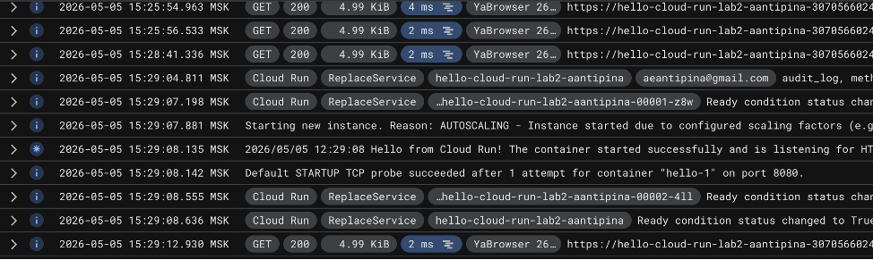
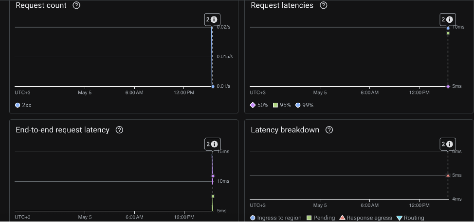
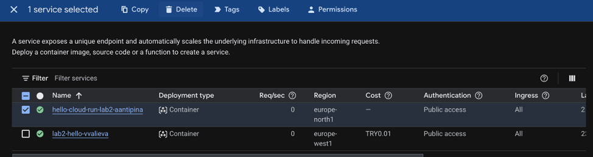

University: [ITMO University](https://itmo.ru/ru/)  
Faculty: [FICT](https://fict.itmo.ru)  
Course: [Cloud platforms as the basis of technology entrepreneurship](https://itmo-ict-faculty.github.io/cloud-platforms-as-the-basis-of-technology-entrepreneurship)  
Year: 2025/2026  
Group: U4125  
Author: Antipina Anastasia Evgenievna  
Lab: Lab2  
Date of create: 04.05.2026  
Date of finished: 

# Отчёт по лабораторной работе №2 **«Исследование Cloud Run.»**

### Шаг 1. Создание Cloud Run сервиса  

* Вошла в Google Cloud Console и перешла в раздел Cloud Run;  
* Нажала Deploy container для развёртывания нового сервиса с указанием параметров:  
```text
Service name: hello-cloud-run-lab2-aantipina.
Region: europe-north1.
Ресурсы: минимальные (CPU — 1, Memory — 256 MB, Concurrency — 80)
```
* Нажала Deploy → дождалась статуса Ready, в итоге был создан сервис:  
<a>
  
</a>

### Шаг 2. Тестирование сервиса  
Перешла по URL сервиса (https://hello-cloud-run-lab2-aantipina-307056602443.europe-north1.run.appc/);  
Увидела что интерфейс полностью отображается:  

<a>
  
</a>

### Шаг 3. Анализ логов и метрик  

* В Cloud Run перешла на страницу сервиса → вкладка Logs;
* Увидела логи GET‑запросов к сайту и проанализироваламстатусы ответов (200 OK):

<a>
  
</a>

* Перешла во вкладку Metrics и изучила и их:

`* End-to-end request latency, диапазон латентности: от 5 мс до 15 мс. — отображал рост при каждом запросе;`

`* Latency breakdown, User execution: основной вклад в латентность — время работы кода сервиса;`  

`* Container instance count, диапазон: от 0 до 1 инстанса, большинство времени работает 1 инстанс, что типично для низконагруженных сервисов;`  

`*  Billable container instance time значение около 0.001 с/с. Низкое значение подтверждает низкую нагрузку — сервис экономичен с точки зрения затрат.`  


<a>
  
</a>

### Шаг 4. Изменение порта контейнера на 8090  

* На странице сервиса нажала Edit and Deploy New Revision и изменила поле Port с 8080 на 8090, после чего нажала Deploy;  
* Результат и особенности:  
> Вопреки ожиданиям, ошибки 503 Service Unavailable не возникло. Это связано с механизмом переменной окружения $PORT, которую Cloud Run автоматически подставляет в контейнер: приложение продолжает слушать порт, назначенный Cloud Run, а не тот, что указан в UI.

<a>
  
</a> 

### Шаг 5. Распределение трафика между версиями  

* На странице сервиса настроила распределение трафика: старая версия (порт 8080) – 50%, новая версия (порт 8090) – 50%;  
* Несколько раз обновил страницу в браузере: обе страницы корректно отображаются, логи и метрики также.  

<a>
  
</a> 

<a>
  
</a> 

### Шаг 6. Удаление сервисов  

* В разделе Cloud Run отметила сервис hello-cloud-run-lab2-aantipina;  
* Нажала Delete → подтвердила удаление.

<a>
  
</a> 
