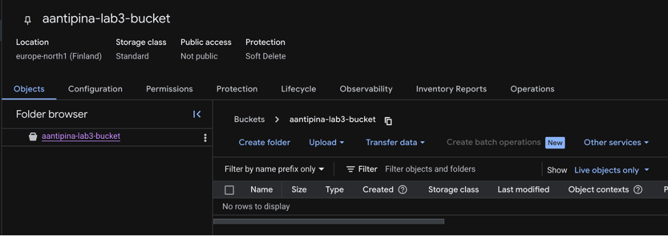
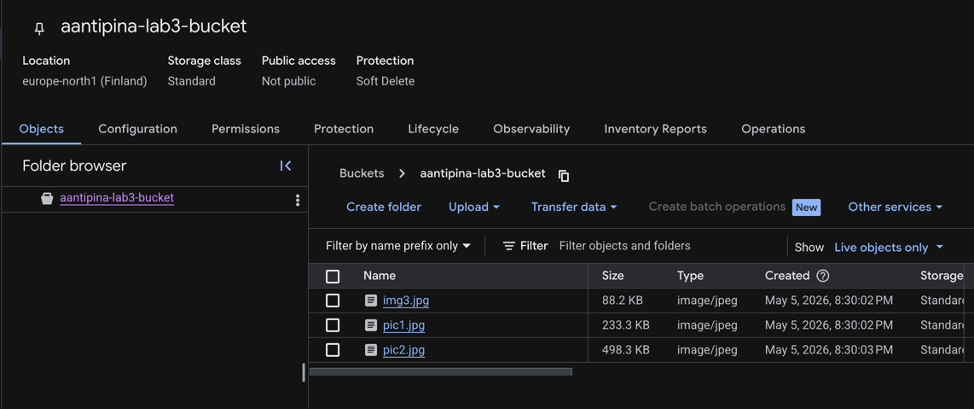
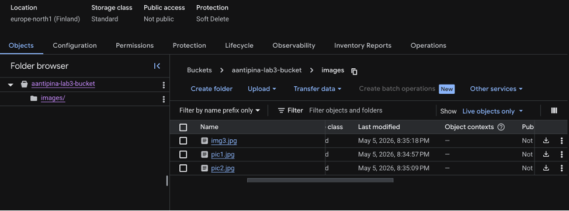
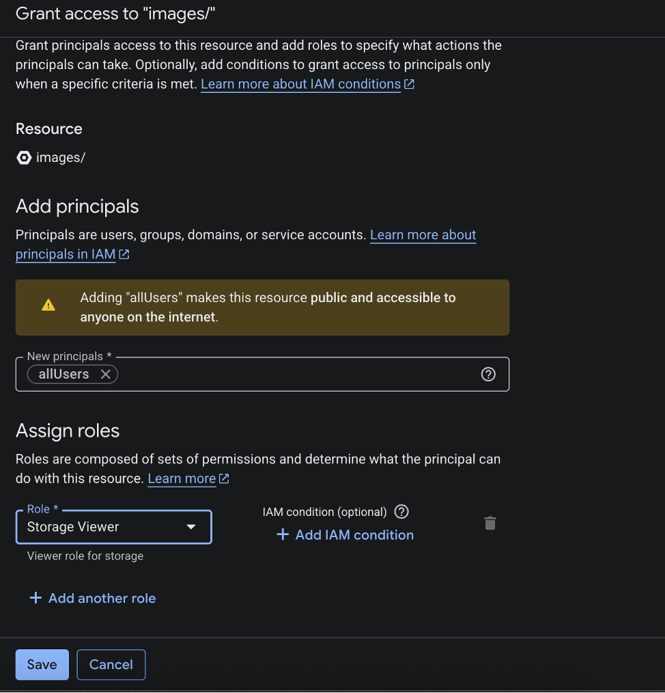
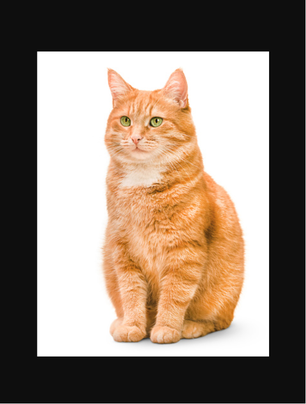

University: [ITMO University](https://itmo.ru/ru/)  
Faculty: [FICT](https://fict.itmo.ru)  
Course: [Cloud platforms as the basis of technology entrepreneurship](https://itmo-ict-faculty.github.io/cloud-platforms-as-the-basis-of-technology-entrepreneurship)  
Year: 2025/2026  
Group: U4125  
Author: Antipina Anastasia Evgenievna  
Lab: Lab3  
Date of create: 05.05.2026  
Date of finished: 

# Отчёт по лабораторной работе №3 **«Исследование Cloud Storage.»**

### Шаг 1. Выбор проекта в GCP  

* В Google Cloud Console выбрала проект cloud-platforms-as-the-basis по умолчанию;  
* С ним перешла в раздел Cloud Storage bucket.  

### Шаг 2. Создание Cloud Storage bucket

* Нажала **Create bucket** и заполнила параметры:
   * **Bucket name:** `aantipina-lab3-bucket`.
   * **Location type:** **europe-north1**.
   * **Storage class:** **Standard**.
   * **Access control:** **Uniform**.
* Создала бакет — статус **Active**.

### Шаг 3. Загрузка изображений в бакет

* Загрузила 3 изображения;
* Проверила, что все файлы успешно загружены.

### Шаг 4. Создание папки и перемещение файлов  

* Создала папку с названием **«images»**;  
* Переместил все 3 файла в папку **«images»**;  
* Проверка: файлы отображаются в папке, путь – `aantipina-lab3-bucket/images`.

### Шаг 5. Настройка публичного доступа

* Выбрала папку **«images»** и все файлы внутри;
* В контекстном меню выбрала **Change permissions**;
* Настроила доступ:
   * **Role:** `allUsers`.
   * **Permission:** `Storage viewer`.
* Сохранила изменения — файлы стали доступны для публичного чтения.

### Шаг 6. Создание ссылок на файлы  

* Для каждого файла в папке **«images»** сгенерировал публичную ссылку через **Copy public URL**;  
* Получила 3 уникальных URL‑адреса:  
   * **`https://storage.googleapis.com/aantipina-lab3-bucket/images/img3.jpg`
   * **`https://storage.googleapis.com/aantipina-lab3-bucket/images/pic2.jpg`
   * **`https://storage.googleapis.com/aantipina-lab3-bucket/images/pic1.jpg`
* Проверила работоспособность ссылок в браузере — все файлы открываются корректно.
 

### Шаг 7. Удаление созданных сервисов

* Удалила все объекты и сам bucket aantipina-lab3-bucket.

## Выводы

В ходе лабораторной работы:

* освоила полный цикл работы с Cloud Storage: от создания проекта до удаления ресурсов;
* научилась настраивать публичный доступ к файлам и генерировать ссылки;
* закрепила навыки работы с консолью GCP и интерфейсом Cloud Storage.
