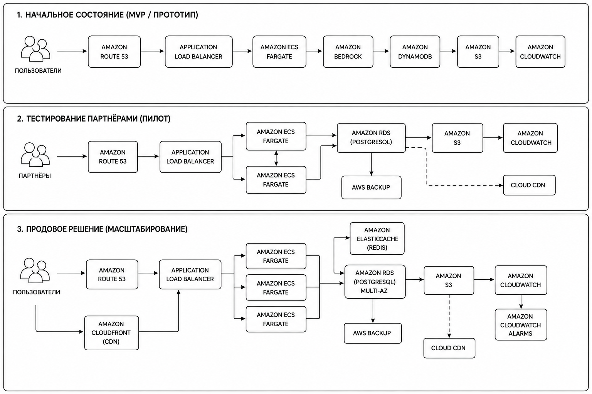

University: [ITMO University](https://itmo.ru/ru/)  
Faculty: [FICT](https://fict.itmo.ru)  
Course: [Cloud platforms as the basis of technology entrepreneurship](https://itmo-ict-faculty.github.io/cloud-platforms-as-the-basis-of-technology-entrepreneurship)  
Year: 2025/2026  
Group: U4125  
Author: Antipina Anastasia Evgenievna  
Lab: Lab4  
Date of create: 07.05.2026  
Date of finished: 

# Отчёт по лабораторной работе №4 **«Разработка инфраструктуры MVP AI приложения.»**  

# Описание приложения  

## Название проекта  
AI‑ассистент для генерации текстов и ответов пользователям.  

## Тип приложения  
Web + AI SaaS приложение.  

## Основная идея  
Пользователь отправляет запрос через веб‑интерфейс, после чего AI‑модель генерирует ответ. Система хранит историю запросов, поддерживает авторизацию и базовую аналитику.  

---

# Основные функции системы  

| Модуль | Описание |
| --- | --- |
| Frontend | Веб‑интерфейс пользователя |
| Backend API | Обработка запросов |
| AI Service | Генерация текста через LLM |
| Database | Хранение пользователей и истории |
| Cache | Ускорение обработки запросов |
| Monitoring | Мониторинг и логирование |
| Authentication | Авторизация пользователей |

---

# Планируемые нагрузки  

| Этап | Нагрузка |
|---|---|
| MVP | до 100 пользователей |
| Партнерское тестирование | до 5 000 пользователей |
| Production | до 10 000 запросов в час |

---

# Стадия 1 — MVP  

## Цель этапа  

Проверка гипотезы продукта с минимальными затратами.  

### Особенности:  
- быстрый запуск продукта;  
- минимальная стоимость;  
- отсутствие сложного администрирования;  
- serverless‑подход.  

---

## Используемые сервисы  

| Ресурс | Конфигурация | Причина выбора |
|---|---|---|
| Cloud Run | 1 vCPU / 512 MB | Автоматический serverless |
| Vertex AI Gemini Flash | API | Не требуется GPU |
| Cloud SQL | db-f1-micro | Минимальные затраты |
| Cloud Storage | 5–10 GB | Хранение файлов и логов |
| Cloud Monitoring | Free Tier | Базовый мониторинг |

---

## Экономическая модель MVP  

| Сервис | Стоимость в месяц |
|---|---|
| Cloud Run | ~0–5 USD |
| Vertex AI | ~1 USD |
| Cloud SQL | ~9 USD |
| Cloud Storage | ~1 USD |
| Monitoring | 0 USD |
| Итого | ~15 USD |

---

# Стадия 2 — Партнерское тестирование  

## Цель этапа  

Подключение партнеров и тестирование системы под реальной нагрузкой.  

### Новые требования:  
- стабильность;  
- масштабируемость;  
- балансировка нагрузки;  
- отказоустойчивость.  

---

## Используемые сервисы  

| Ресурс | Конфигурация | Назначение |
|---|---|---|
| Cloud Run | Несколько сервисов | Масштабирование |
| Load Balancer | HTTP(S) | Распределение нагрузки |
| Cloud CDN | Enabled | Ускорение загрузки |
| Memorystore Redis | 1 GB | Кэширование |
| Cloud SQL | db-n1-standard-1 | Рост нагрузки |
| Vertex AI | API | AI‑генерация |
| Monitoring + Alerting | Enabled | Контроль системы |

---

## Экономическая модель тестирования  

| Сервис | Стоимость |
|---|---|
| Cloud Run | ~30 USD |
| Vertex AI | ~10 USD |
| Cloud SQL | ~50 USD |
| Redis | ~35 USD |
| CDN + LB | ~30 USD |
| Monitoring | ~10 USD |
| Итого | ~165 USD |

---

# Стадия 3 — Production  

## Цель этапа  

Создать отказоустойчивую и масштабируемую платформу.  

### Основные требования:  
- высокая доступность;  
- автоматическое масштабирование;  
- защита от DDoS;  
- обработка больших нагрузок.  

---

## Используемые сервисы  

| Ресурс | Конфигурация | Причина использования |
|---|---|---|
| GKE Autopilot | Автоскейлинг | Высокая нагрузка |
| Vertex AI Endpoints | Production inference | Стабильный AI |
| Cloud SQL HA | Репликация | Отказоустойчивость |
| Redis Cluster | 5 GB | Быстрый доступ |
| Pub/Sub | Очереди | Асинхронные задачи |
| Cloud Armor | WAF | Защита от DDoS |
| Cloud Storage | 1 TB | Хранение данных |
| Monitoring | Full stack | Наблюдаемость |

---

## Экономическая модель Production  

| Сервис | Стоимость |
|---|---|
| GKE | ~600 USD |
| Vertex AI | ~200 USD |
| Cloud SQL HA | ~400 USD |
| Redis Cluster | ~150 USD |
| Cloud Armor | ~200 USD |
| Load Balancer + CDN | ~100 USD |
| Monitoring | ~50 USD |
| Storage | ~30 USD |
| Итого | ~1700–2000 USD |

---

# Сравнение архитектур  

| Параметр | MVP | Тестирование | Production |
|---|---|---|---|
| Архитектура | Serverless | Cloud Native | Kubernetes |
| Масштабирование | Автоматическое | Горизонтальное | Полноценный autoscaling |
| AI | API | API | Dedicated Endpoints |
| База данных | Минимальная | Стандартная | HA Cluster |
| Кэширование | Нет | Redis | Redis Cluster |
| Безопасность | Базовая | Средняя | WAF + защита |
| Стоимость | ~15 USD | ~165 USD | ~2000 USD |

---

# Обоснование выбранного подхода  

## 1. Постепенное масштабирование  

Инфраструктура развивается вместе с продуктом.  

Это позволяет:  
- не переплачивать на старте;  
- постепенно увеличивать ресурсы;  
- избежать полной миграции системы.  

---

## 2. Использование managed‑сервисов  

Cloud Run, Cloud SQL и Vertex AI уменьшают затраты на DevOps и поддержку.  

Команда может сосредоточиться на разработке продукта.  

---

## 3. Kubernetes только при необходимости  

Kubernetes сложнее и дороже в поддержке, поэтому его использование оправдано только при больших нагрузках.  

# Вывод  

В ходе лабораторной работы была разработана инфраструктура AI‑приложения для трех стадий жизненного цикла:  
- MVP;  
- партнерское тестирование;  
- Production.  

Было показано, как система постепенно масштабируется от serverless‑архитектуры до полноценной Kubernetes‑платформы.  

Также была рассчитана примерная экономическая модель и обоснован выбор облачных сервисов.  

Предложенная архитектура позволяет:  
- минимизировать расходы на старте;  
- обеспечить гибкое масштабирование;  
- поддерживать высокую доступность при росте нагрузки.
